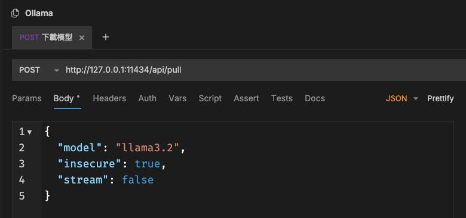

# Ollama API對接測試
- 測試[WWSimpleAI_Ollama](https://github.com/William-Weng/WWSimpleAI_Ollama)套件的功能是否正常運行…
- 測試使用WebView去處理Ollama的回應訊息 - [NDJSON](https://docs.mulesoft.com/dataweave/latest/dataweave-formats-ndjson)…
- 學習如何使用WebView這個大套件…

## [測試環境](https://swiftpackageindex.com/William-Weng)
|環境|版本|
|---|---|
|[Xcode](https://developer.apple.com/xcode/)|16.2|
|[Orbstack](https://orbstack.dev/)|1.10.3|
|[Ollama](https://ollama.com/)|0.6.5|
|[llama](https://ollama.com/library/llama3.2)|3.2|

## [使用套件](https://github.com/William-Weng/)
|套件|版本|
|---|---|
|[WWEventSource](https://github.com/William-Weng/WWEventSource)|1.4.0|
|[WWExpandableTextView](https://github.com/William-Weng/WWExpandableTextView)|1.0.3|
|[WWHUD](https://github.com/William-Weng/WWHUD)|1.3.3|
|[WWKeyboardShadowView](https://github.com/William-Weng/WWKeyboardShadowView)|1.1.0|
|[WWSimpleAI_Ollama](https://github.com/William-Weng/WWSimpleAI_Ollama)|1.1.7|

## [使用步驟](https://william-weng.github.io/2025/01/docker容器大家一起來當鯨魚搬運工吧/ )
- 使用Docker建立Ollama環境
- 使用Ollama下載llama3.2的Model
- 執行Xcode IDE運行Example

